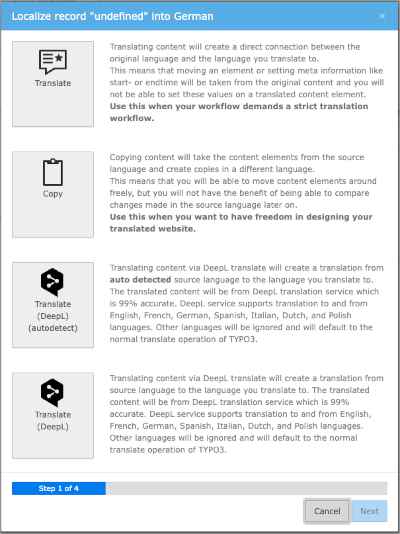

[](https://packagist.org/packages/web-vision/wv_deepltranslate)
[](https://packagist.org/packages/web-vision/wv_deepltranslate)
[](https://get.typo3.org/version/11)
[](https://get.typo3.org/version/12)
[](https://packagist.org/packages/web-vision/wv_deepltranslate)
[](https://packagist.org/packages/web-vision/wv_deepltranslate)

# TYPO3 extension `wv_deepltranslate`

This extension provides automated translation of pages, content and records in TYPO3
for languages supported by [DeepL](https://www.deepl.com/de/docs-api/).

## Features

* Translate content elements via TYPO3 built-in translation wizard
* Single drop down translation parallel to regular page translation
  * Translate your page with all fields you want
* One-Click translation of single records
* Glossary support
  * Manage your own glossaries in TYPO3
  * Synchronise glossaries to DeepL API
  * Translate content using your glossaries



## Early-Access-Programm

Early access partners of DeepL Translate will benefit from exclusive access to all add-ons, developer preview versions, access to private GitHub repositories, priority support, logo placement and a backlink on the official website. You will also get access to the DeepL Translate version 5.0 announced for TYPO3 v13.

The following add-ons are currently available as part of the Early Access Program:

* **DeepL Translate Assets**: Translation of file meta data with DeepL
* **DeepL Translate Auto-Renew**: Automatic creation of pages and content elements in translations, renewal of translations when the original language changes
* **DeepL Translate Bulk**: Bulk translation of pages and content based on the page tree
* **Enable Translated Content**: Activation of all translated content elements with one click

Find out more: https://www.web-vision.de/en/deepl.html

## Installation

Install with your favour:

* [Composer](https://packagist.org/packages/web-vision/wv_deepltranslate)
* [TER / Extension Manager](https://extensions.typo3.org/extension/wv_deepltranslate/)
* [Git](https://github.com/web-vision/wv_deepltranslate)

We prefer composer installation:
```bash
composer req web-vision/wv_deepltranslate
```

The DeepL translation buttons are only displayed once you have set up the API
and desired target languages. Read the documentation to find out how to do this.

## Documentation

Read online: https://docs.typo3.org/p/web-vision/wv_deepltranslate/main/en-us/

## Sponsors

We appreciate very much the sponsorships of the developments and features in
the DeepL Translate Extension for TYPO3.

### DeepL Glossary feature sponsored by

* [Universität Osnabrück](https://www.uni-osnabrueck.de)
* [Hochschule für Musik Würzburg](https://www.hfm-wuerzburg.de)
* [Carl von Ossietzky Universität Oldenburg](https://uol.de/)
* [Friedrich-Ebert-Stiftung](https://www.fes.de)

### DeepL "Add automatic translation flag and hint" sponsored by

* [FH Aachen](https://www.fh-aachen.de/)

## Create a release (maintainers only)

Prerequisites:

* git binary
* ssh key allowed to push new branches to the repository
* GitHub command line tool `gh` installed and configured with user having permission to create pull requests.

**Prepare release locally**

> Set `RELEASE_BRANCH` to branch release should happen, for example: 'main'.
> Set `RELEASE_VERSION` to release version working on, for example: '4.4.4'.

```shell
echo '>> Prepare release pull-request' ; \
  RELEASE_BRANCH='main' ; \
  RELEASE_VERSION='4.4.4' ; \
  git checkout main && \
  git fetch --all && \
  git pull --rebase && \
  git checkout ${RELEASE_BRANCH} && \
  git pull --rebase && \
  git checkout -b prepare-release-${RELEASE_VERSION} && \
  composer require --dev "typo3/tailor" && \
  ./.Build/bin/tailor set-version ${RELEASE_VERSION} && \
  composer remove --dev "typo3/tailor" && \
  git add . && \
  git commit -m "[TASK] Prepare release ${RELEASE_VERSION}" && \
  git push --set-upstream origin prepare-release-${RELEASE_VERSION} && \
  gh pr create --fill-verbose --base ${RELEASE_BRANCH} --title "[TASK] Prepare release for ${RELEASE_VERSION} on ${RELEASE_BRANCH}" && \
  git checkout main && \
  git branch -D prepare-release-${RELEASE_VERSION}
```

Check pull-request and the pipeline run.

**Merge approved pull-request and push version tag**

> Set `RELEASE_PR_NUMBER` with the pull-request number of the preparation pull-request.
> Set `RELEASE_BRANCH` to branch release should happen, for example: 'main' (same as in previous step).
> Set `RELEASE_VERSION` to release version working on, for example: `4.4.4` (same as in previous step).

```shell
RELEASE_BRANCH='main' ; \
RELEASE_VERSION='4.4.4' ; \
RELEASE_PR_NUMBER='123' ; \
  git checkout main && \
  git fetch --all && \
  git pull --rebase && \
  gh pr checkout ${RELEASE_PR_NUMBER} && \
  gh pr merge -rd ${RELEASE_PR_NUMBER} && \
  git tag ${RELEASE_VERSION} && \
  git push --tags
```

This triggers the `on push tags` workflow (`publish.yml`) which creates the upload package,
creates the GitHub release and also uploads the release to the TYPO3 Extension Repository.
