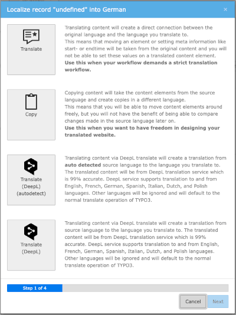

[](https://packagist.org/packages/web-vision/deepltranslate-core)
[](https://packagist.org/packages/web-vision/wv_deepltranslate)
[](https://get.typo3.org/version/14.2)
[](https://get.typo3.org/version/13.4)
[](https://get.typo3.org/version/12.4)
[](https://packagist.org/packages/web-vision/deepltranslate-core)
[](https://packagist.org/packages/web-vision/deepltranslate-core)
[](https://packagist.org/packages/web-vision/wv_deepltranslate)
[](https://packagist.org/packages/web-vision/wv_deepltranslate)

# TYPO3 extension `deepltranslate_core`


|                  | URL                                                                 |
|------------------|---------------------------------------------------------------------|
| **Repository:**  | https://github.com/web-vision/deepltranslate-core                   |
| **Read online:** | https://docs.typo3.org/p/web-vision/deepltranslate-core/main/en-us/ |
| **TER:**         | https://extensions.typo3.org/extension/deepltranslate_core/         |
| **ISSUES:**      | https://github.com/web-vision/deepltranslate-core/issues/           |
| **RELEASES:**    | https://github.com/web-vision/deepltranslate-core/releases/         |

## Description

This extension provides automated translation of pages, content and records in TYPO3
for languages supported by [DeepL](https://www.deepl.com/de/docs-api/).

## Compatibility

| Branch | State          | Composer Package Name          | TYPO3 Extension Key | Version       | TYPO3     | PHP                                               |
|--------|----------------|--------------------------------|---------------------|---------------|-----------|---------------------------------------------------|
| main   | development    | web-vision/deepltranslate-core | deepltranslate_core | 6.0.x-dev     | v13 + v14 | 8.2, 8.3, 8.4, 8.5 (depending on TYPO3)           |
| 5      | active support | web-vision/deepltranslate-core | deepltranslate_core | ^5, 5.1.x-dev | v12 + v13 | 8.1, 8.2, 8.3, 8.4, 8.5 (depending on TYPO3)      |
| 4      | end of live    | web-vision/wv_deepltranslate   | wv_deepltranslate   | -             | -         | -                                                 |
| 3      | end of live    | web-vision/wv_deepltranslate   | wv_deepltranslate   | -             | -         | -                                                 |
| 2      | end of live    | web-vision/wv_deepltranslate   | wv_deepltranslate   | -             | -         | -                                                 |
| 1      | end of live    | web-vision/wv_deepltranslate   | wv_deepltranslate   | -             | -         | -                                                 |

## Features

* Translate content elements via TYPO3 built-in translation wizard
* Single drop down translation parallel to regular page translation
  * Translate your page with all fields you want
* One-Click translation of single records
* Glossary support
  * Manage your own glossaries in TYPO3
  * Synchronise glossaries to DeepL API
  * Translate content using your glossaries



## Early-Access-Programm

Early access partners of DeepL Translate will benefit from exclusive access to all add-ons, developer preview versions, access to private GitHub repositories, priority support, logo placement and a backlink on the official website. You will also get access to the DeepL Translate version 5.0 announced for TYPO3 v13.

The following add-ons are currently available as part of the Early Access Program:

* **DeepL Translate Assets**: Translation of file meta data with DeepL
* **DeepL Translate Auto-Renew**: Automatic creation of pages and content elements in translations, renewal of translations when the original language changes
* **DeepL Translate Bulk**: Bulk translation of pages and content based on the page tree
* **Enable Translated Content**: Activation of all translated content elements with one click

Find out more: https://www.web-vision.de/en/deepl.html

## Installation

Install with your flavour:

* [TER](https://extensions.typo3.org/extension/deepltranslate_core/)
* Extension Manager
* composer

We prefer composer installation:

```bash
composer require 'web-vision/deepltranslate-core':'6.0.*@dev'
```

> [!IMPORTANT]
> `6.0.0` is still in development and not released yet and add-ons,
> public and private, are not touched yet and will be worked after
> having `EXT:deepltranslate_core` in a first usable state.

**Testing 6.0.0-dev version in projects (composer mode)**

> [!IMPORTANT]
> Currently none of the addons are touched yet and can be used with `6.0.0-dev`
> for TYPO3 v13 or TYPO3 v14, which we will start working on the next time.
> That means, that you need to remove them first before upgrading to `6.0.0-dev`.

It is already possible to use and test the `6.0.0-dev` version in composer based
instances, which is encouraged. We also encourage to give early feedback of issues
not detected by us or contributors.

Your project should configure `minimum-stabilty: dev` and `prefer-stable` to allow
requiring each extension but still use stable versions over development versions:

```bash
composer config minimum-stability "dev" \
&& composer config "prefer-stable" true
```

and remove possible addons:

```bash
composer require -W \
  'web-vision/deepl-write' \
  'web-vision/deepltranslate-glossary' \
  'web-vision/deepltranslate-assets' \
  'web-vision/deepltranslate-auto-renew' \
  'web-vision/deepltranslate-mass'
```

and installed with:

```bash
composer require -W \
  'web-vision/deepl-base':'2.0.*@dev' \
  'web-vision/deepltranslate-core':'6.0.*@dev' \
&& vendor/bin/typo3 extension:setup \
&& vendor/bin/typo3 language:update \
&& vendor/bin/typo3 cache:flush \
&& vendor/bin/typo3 cache:warmup
```

> [!NOTE]
> To avoid deprecation messages regarding deprecated `ext_emconf.php` you should
> disable logging deprecations or you need to apply a couple of composer patches
> against TYPO3 v14.2 (feature freeze).
> TYPO3 v14.3 (LTS) development currently not supported and possible needs more
> work and adoption depending what of the pending gerrit changes will be merged.

## Add-Ons

* [**DeepL Translate Glossary**](https://github.com/web-vision/deepltranslate-glossary):
  TYPO3-managed glossary for custom translation support

## Sponsors

We appreciate very much the sponsorships of the developments and features in
the DeepL Translate Extension for TYPO3.

### DeepL "Add automatic translation flag and hint" sponsored by

* [FH Aachen](https://www.fh-aachen.de/)

## Create a release (maintainers only)

Prerequisites:

* git binary
* ssh key allowed to push new branches to the repository
* GitHub command line tool `gh` installed and configured with user having permission to create pull requests.

**Prepare release locally**

> Set `RELEASE_BRANCH` to branch release should happen, for example: 'main'.
> Set `RELEASE_VERSION` to release version working on, for example: '5.0.0'.

```bash
echo '>> Create release based on configuration' ; \
  RELEASE_BRANCH='main' ; \
  RELEASE_VERSION='6.0.0' ; \
  DEV_VERSION='6.0.1' ; \
  echo ">> Checkout branches" && \
  git checkout main && \
  git fetch --all && \
  git pull --rebase && \
  git checkout ${RELEASE_BRANCH} && \
  git pull --rebase && \
  echo ">> Create release ${RELEASE_VERSION}" && \
  git checkout -b release-${RELEASE_VERSION} && \
  sed -i "s/^COMPOSER_ROOT_VERSION.*/COMPOSER_ROOT_VERSION=\"${RELEASE_VERSION}\"/" Build/Scripts/runTests.sh && \
  sed -i "s/^  RELEASE_VERSION.*/  RELEASE_VERSION=\"${RELEASE_VERSION}\"/" README.md && \
  sed -i "s/^  DEV_VERSION.*/  DEV_VERSION=\"${DEV_VERSION}\"/" README.md && \
  tailor set-version ${RELEASE_VERSION} && \
  composer config "extra"."typo3/cms"."version" "${RELEASE_VERSION}" && \
  echo "${RELEASE_VERSION}" > VERSION && \
  git add . && \
  git commit -m "[RELEASE] ${RELEASE_VERSION}" && \
  git push --set-upstream origin release-${RELEASE_VERSION} && \
  gh pr create --fill --base ${RELEASE_BRANCH} --title "[RELEASE] ${RELEASE_VERSION}" && \
  gh pr checks --watch --interval 2 && \
  gh pr merge -rd --admin && \
  git remote prune origin && \
  git tag ${RELEASE_VERSION} \
  git push origin ${RELEASE_VERSION} \
  echo ">> Post-release - set dev version: ${DEV_VRESION}-dev" && \
  git checkout -b set-version-${DEV_VERSION} && \
  sed -i "s/^COMPOSER_ROOT_VERSION.*/COMPOSER_ROOT_VERSION=\"${DEV_VERSION}-dev\"/" Build/Scripts/runTests.sh && \
  tailor set-version ${DEV_VERSION} && \
  composer config "extra"."typo3/cms"."version" "${DEV_VERSION}-dev" && \
  echo "${DEV_VERSION}-dev" > VERSION && \
  git add . && \
  git commit -m "[TASK] Set dev version ${DEV_VERSION}" && \
  gh pr create --fill --base ${RELEASE_BRANCH} --title "[RELEASE] ${RELEASE_VERSION}" && \
  gh pr checks --watch --interval 2 && \
  gh pr merge -rd --admin
```
