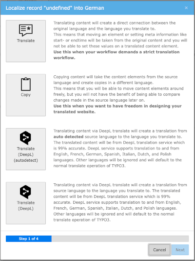

[](https://packagist.org/packages/web-vision/wv_deepltranslate)
[](https://packagist.org/packages/web-vision/wv_deepltranslate)
[](https://get.typo3.org/version/11)
[](https://get.typo3.org/version/12)
[](https://packagist.org/packages/web-vision/wv_deepltranslate)
[](https://packagist.org/packages/web-vision/wv_deepltranslate)

# TYPO3 extension `deepltranslate_core`

This extension provides automated translation of pages, content and records in TYPO3
for languages supported by [DeepL](https://www.deepl.com/de/docs-api/).

## Features

* Translate content elements via TYPO3 built-in translation wizard
* Single drop down translation parallel to regular page translation
  * Translate your page with all fields you want
* One-Click translation of single records
* Glossary support
  * Manage your own glossaries in TYPO3
  * Synchronise glossaries to DeepL API
  * Translate content using your glossaries



## Early-Access-Programm

Early access partners of DeepL Translate will benefit from exclusive access to all add-ons, developer preview versions, access to private GitHub repositories, priority support, logo placement and a backlink on the official website. You will also get access to the DeepL Translate version 5.0 announced for TYPO3 v13.

The following add-ons are currently available as part of the Early Access Program:

* **DeepL Translate Assets**: Translation of file meta data with DeepL
* **DeepL Translate Auto-Renew**: Automatic creation of pages and content elements in translations, renewal of translations when the original language changes
* **DeepL Translate Bulk**: Bulk translation of pages and content based on the page tree
* **Enable Translated Content**: Activation of all translated content elements with one click

Find out more: https://www.web-vision.de/en/deepl.html

## Installation

Install with your favour:

* [Composer](https://packagist.org/packages/web-vision/deepltranslate-core)
* [TER / Extension Manager](https://extensions.typo3.org/extension/deepltranslate_core/)
* [Git](https://github.com/web-vision/deepltranslate-core)

We prefer composer installation:
```bash
composer require web-vision/deepltranslate-core
```

The DeepL translation buttons are only displayed once you have set up the API
and desired target languages. Read the documentation to find out how to do this.

## Documentation

Read online: https://docs.typo3.org/p/web-vision/deepltranslate-core/main/en-us/

## Add-Ons

* [**DeepL Translate Glossary**](https://github.com/web-vision/deepltranslate-glossary):
  TYPO3-managed glossary for custom translation support

## Sponsors

We appreciate very much the sponsorships of the developments and features in
the DeepL Translate Extension for TYPO3.

### DeepL "Add automatic translation flag and hint" sponsored by

* [FH Aachen](https://www.fh-aachen.de/)

## Create a release (maintainers only)

Prerequisites:

* git binary
* ssh key allowed to push new branches to the repository
* GitHub command line tool `gh` installed and configured with user having permission to create pull requests.

**Prepare release locally**

> Set `RELEASE_BRANCH` to branch release should happen, for example: 'main'.
> Set `RELEASE_VERSION` to release version working on, for example: '5.0.0'.

```bash
echo '>> Create release based on configuration' ; \
  RELEASE_BRANCH='5' ; \
  RELEASE_VERSION='5.1.6' ; \
  DEV_VERSION='5.1.7' ; \
  echo ">> Checkout branches" && \
  git checkout main && \
  git fetch --all && \
  git pull --rebase && \
  git checkout ${RELEASE_BRANCH} && \
  git pull --rebase && \
  echo ">> Create release ${RELEASE_VERSION}" && \
  git checkout -b release-${RELEASE_VERSION} && \
  sed -i "s/^COMPOSER_ROOT_VERSION.*/COMPOSER_ROOT_VERSION=\"${RELEASE_VERSION}\"/" Build/Scripts/runTests.sh && \
  sed -i "s/^  RELEASE_VERSION.*/  RELEASE_VERSION='${RELEASE_VERSION}' ; \\\\/" README.md && \
  sed -i "s/^  DEV_VERSION.*/  DEV_VERSION='${DEV_VERSION}' ; \\\\/" README.md && \
  tailor set-version ${RELEASE_VERSION} && \
  composer config "extra"."typo3/cms"."version" "${RELEASE_VERSION}" && \
  echo "${RELEASE_VERSION}" > VERSION && \
  git add . && \
  git commit -m "[RELEASE] ${RELEASE_VERSION}" && \
  git push --set-upstream origin release-${RELEASE_VERSION} && \
  gh pr create --fill --base ${RELEASE_BRANCH} --title "[RELEASE] ${RELEASE_VERSION}" && \
  sleep 10 && \
  gh pr checks --watch --interval 2 && \
  sleep 10 && \
  gh pr merge -rd --admin && \
  git remote prune origin && \
  git tag ${RELEASE_VERSION} && \
  git push origin ${RELEASE_VERSION} && \
  echo ">> Post-release - set dev version: ${DEV_VRESION}-dev" && \
  git checkout -b set-dev-version-${DEV_VERSION} && \
  sed -i "s/^COMPOSER_ROOT_VERSION.*/COMPOSER_ROOT_VERSION=\"${DEV_VERSION}-dev\"/" Build/Scripts/runTests.sh && \
  tailor set-version ${DEV_VERSION} && \
  composer config "extra"."typo3/cms"."version" "${DEV_VERSION}-dev" && \
  echo "${DEV_VERSION}-dev" > VERSION && \
  git add . && \
  git commit -m "[TASK] Set dev version ${DEV_VERSION}" && \
  git push --set-upstream origin set-dev-version-${DEV_VERSION} && \
  gh pr create --fill --base ${RELEASE_BRANCH} --title "[TASK] Set dev version \"${DEV_VERSION}-dev\"" && \
  sleep 10 && \
  gh pr checks --watch --interval 2 && \
  sleep 10 && \
  gh pr merge -rd --admin && \
  git remote prune origin
```
